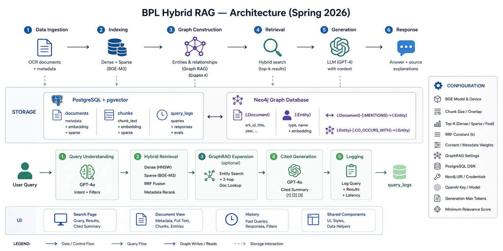

<p align="center">
  
</p>

<h1 align="center">BPL-LIBRAG</h1>
<p align="center">
  <b>B</b>oston <b>P</b>ublic <b>L</b>ibrary <b>L</b>arge<b>-</b>archive hybr<b>I</b>d <b>B</b>GE-M3 + Graph<b>R</b>AG arch<b>A</b>eolo<b>G</b>ical search
</p>

<p align="center">
  <b>Spring 2026 development snapshot</b> of the
  <a href="https://github.com/BU-Spark/ml-bpl-rag"><b>BU Spark! BPL RAG</b></a>
  project, in collaboration with the
  <a href="https://www.bpl.org/"><b>Boston Public Library</b></a>
  and the
  <a href="https://www.digitalcommonwealth.org/"><b>Digital Commonwealth</b></a> consortium.
</p>

<p align="center">
  <b>BU Spark! Team — Spring 2026</b><br/>
  <a href="#">Ryan Rodriguez</a> <i>(PM)</i> ·
  <a href="#">Shinu Shibu</a> <i>(TPM)</i> ·
  <a href="https://github.com/hannasamuel20">Hanna S. Tadesse</a> ·
  <a href="https://github.com/vivinia-c">Vivinia Cai</a> ·
  <a href="https://github.com/ManaswiYadamreddy">Manaswi Yadamreddy</a> ·
  <a href="https://github.com/JimmyToluene">Haozhe (Jimmy) Jia</a>
</p>

<p align="center">
  <a href="https://www.python.org/downloads/"></a>
  <a href="https://huggingface.co/BAAI/bge-m3"></a>
  <a href="https://github.com/pgvector/pgvector"></a>
  <a href="https://neo4j.com/"></a>
  <a href="https://platform.openai.com/docs/models/gpt-4o"></a>
  <a href="https://streamlit.io/"></a>
  <a href="https://www.gnu.org/licenses/gpl-3.0"></a>
</p>

---

This directory contains a **hybrid retrieval-augmented search system** over the
Boston Public Library's *Digital Commonwealth* archive — historical newspapers,
photographs, maps, manuscripts, and other digitized materials from
Massachusetts institutions. Users ask questions in natural language and get
cited, source-grounded answers drawn from the underlying collection.

The pipeline is designed to handle the heterogeneity of an archival corpus:
full-text records (e.g. the *Boston Traveler*), metadata-only records,
multi-decade date ranges, and sparse or noisy OCR — all unified through a
single ingestion pass and a single retrieval entrypoint
([`pipeline.py`](pipeline.py)).

> **Branch:** `hybrid-rag-dev` 
>
> 
> Dashboard: https://huggingface.co/spaces/spark-ds549/BPL-RAG-Spring-2026: 
>
> see [Running the App](#9-running-the-app) for local launch instructions.
> 
<p align="center">
  
</p>

The system combines, end-to-end inside this folder:

- **BGE-M3** dense + sparse embeddings (1024-d), encoded in a single forward
  pass for both metadata and chunk text — see
  [`embedding/embedder.py`](embedding/embedder.py).
- **Hybrid retrieval** over PostgreSQL + `pgvector`: dense ANN (HNSW) +
  sparse lexical scoring + **Reciprocal Rank Fusion** + metadata-embedding
  rerank — see [`retrieval/retriever.py`](retrieval/retriever.py).
- **GraphRAG** layer in Neo4j: spaCy NER → entity vector index → two-hop
  `CO_OCCURS_WITH` traversal, triggered selectively for entity-centric queries
  — see [`graph/`](graph/).
- **Cited generation** with GPT-4o that produces a 3–5 sentence summary with
  inline `[1][2]` references back to retrieved documents — see
  [`generation/generator.py`](generation/generator.py).
- **Multi-page Streamlit UI** (search · document detail · query history) with
  every query logged to `query_logs` for evaluation — see
  [`app.py`](app.py), [`pages/`](pages/), and [`ui/`](ui/).

> Every tunable constant — chunking, retrieval top-k, fusion weights, GraphRAG
> thresholds — is centralized in [`config.py`](config.py); change there,
> affects everywhere.

---

## 2. Project Goals

Let users ask plain-English questions about the BPL *Digital Commonwealth*
collection and get short, cited answers grounded in real archival records.

**In scope:**

- Ingest full-text and metadata-only records through one pipeline.
- Hybrid retrieval: dense + sparse + metadata rerank.
- GraphRAG for entity-centric queries.
- Cited GPT-4o answers with `[1][2]` references — no hallucination.
- Multi-page Streamlit UI with query logging.

**Out of scope:**

- Image / IIIF / multimodal retrieval.
- Audio ingestion.
- Full-corpus graph build (only specific years are validated).
- Automated eval scoring (logging is in place, scoring loop is not).
- Hosted / authenticated deployment.

---

## 3. Repository Structure

```
current_spring2026/
├── app.py                      # Streamlit entry — search page
├── pipeline.py                 # End-to-end query pipeline (classify → retrieve → graph → generate → log)
├── config.py                   # All tunable constants (chunking, top-k, weights, DSNs)
├── environment.yml             # Conda env (Python 3.11)
├── requirements.txt            # Pip deps
│
├── ingestion/
│   ├── ingest.py               # Two-source ingestion (full-text + metadata-only)
│   └── chunker.py              # 1024-token / 150-overlap chunker (cl100k_base)
│
├── embedding/
│   └── embedder.py             # BGE-M3 dense+sparse encoder (singleton)
│
├── database/
│   └── schema.py               # pgvector DDL: documents, chunks, query_logs
│
├── retrieval/
│   ├── query_understanding.py  # GPT-4o classifier → QueryIntent
│   └── retriever.py            # Dense + sparse + RRF + metadata rerank
│
├── graph/
│   ├── entity_extractor.py     # spaCy NER (PERSON/PLACE/ORG/EVENT/DATE)
│   ├── graph_builder.py        # Builds Neo4j graph from PostgreSQL
│   ├── graph_retriever.py      # Two-hop CO_OCCURS_WITH traversal
│   └── neo4j_client.py         # Driver + schema setup
│
├── generation/
│   └── generator.py            # GPT-4o cited summary writer
│
├── evaluation/
│   └── logger.py               # Writes events to query_logs
│
│
├── submit.sh                   # SCC: ingest full-text
├── submit_metadata.sh          # SCC: ingest metadata-only
└── submit_graphrag.sh          # SCC: build graph for selected years
```

Anything not listed (`.venv/`, `__pycache__/`, `logs/`, `*.log`) is build
artefacts or local state; do not commit.

---

## 4. Setup & Installation

### Prerequisites

- **Python 3.11** (pinned in [`environment.yml`](environment.yml))
- **PostgreSQL 14+** with the [`pgvector`](https://github.com/pgvector/pgvector) extension
- **Neo4j 5+** with vector index support (only required if `GRAPH_RAG_ENABLED=True`)
- **GPU** strongly recommended for ingestion / graph build (BGE-M3 + spaCy);
  retrieval works fine on CPU.

### Environment

```bash
# Conda (recommended — matches the SCC submit scripts)
conda env create -f environment.yml
conda activate spark-rag
```

### Configuration

Create `current_spring2026/.env`:

```env
OPENAI_API_KEY=sk-...

PG_HOST=localhost
PG_PORT=5432
PG_DB=bpl_rag
PG_USER=postgres
PG_PASSWORD=...

NEO4J_URI=bolt://localhost:7687
NEO4J_USER=neo4j
NEO4J_PASSWORD=...
```

All other knobs (chunk size, top-k, fusion weights, GraphRAG thresholds) live
in [`config.py`](config.py).

### Bootstrap the schemas

Run once, in order:

```bash
python -m database.schema       # creates documents / chunks / query_logs (+ HNSW)
python -m graph.neo4j_client    # creates Entity / Document constraints + vector index
```

---

## 5. Running the Pipeline

### Data layout (expected)

```
data/
├── fulltext/
│   └── <collection>/<year>.json     # e.g. boston-traveler/1900.json
└── metadata/
    └── metadata.jsonl               # one JSON object per line
```

### Ingestion

```bash
# Full-text only
python -m ingestion.ingest --fulltext-dir data/fulltext --skip-metadata

# Metadata only
python -m ingestion.ingest --metadata-file data/metadata/metadata.jsonl --skip-fulltext

# Both
python -m ingestion.ingest
```

### Graph build (optional, only if using GraphRAG)

```bash
python -m graph.graph_builder --year 1900   # one year
python -m graph.graph_builder --all         # whole corpus
```

### On the SCC

The three `submit_*.sh` scripts wrap the commands above for `qsub`:

```bash
qsub submit.sh            # ingest full-text (1 GPU, 30h)
qsub submit_metadata.sh   # ingest metadata-only (1 GPU, 30h)
qsub submit_graphrag.sh   # build graph for selected years (1 GPU, 4h)
```

### Run a query (CLI)

```bash
python pipeline.py "What happened in Boston in 1900?"
```

Prints the cited summary, the ranked documents, and total latency.

### Run the Streamlit app

```bash
streamlit run app.py
```

or if you're on the scc

```bash
streamlit run app.py --server.address 0.0.0.0 --server.port 8501 --server.baseUrlPath ""
```
---

## 6. Handoff Notes for the Next Team

**What's done.** A full hybrid RAG pipeline you can run end-to-end: ingest →
retrieve → (optional) graph expand → generate cited answer → log. Follow
Sections 4–5 and you should be querying the corpus on day one.

**Known rough edges.**

- No automated eval scoring yet (queries are logged, scores aren't computed).
- GraphRAG validated only on years 1900–1901 — whole-corpus build untested.
- A couple of half-finished helpers in the sparse-search path
  (`embed_one_sparse`, the `TOP_K_BM25` name) and some commented-out code in
  `generation/generator.py` to tidy up.
- `embed-fulltext.log` and `embed-metadata.log` are committed — move them
  into `logs/` and gitignore.

**Where to start.**

1. **Day 1.** Set up `.env`, bootstrap both schemas, ingest one small year of
   data, run `python pipeline.py "test query"`. If you get a cited answer
   back, the whole stack works.
2. **Then read, in this order:** `config.py` → `pipeline.py` →
   `retrieval/retriever.py` → `retrieval/query_understanding.py` →
   `graph/graph_retriever.py`.
3. **First real task:** build the eval harness. `query_logs` already has
   empty `relevancy_score` / `faithfulness_score` columns; wire RAGAS or
   DeepEval (both already in [`environment.yml`](environment.yml)) to fill
   them. Without this, every other change is a guess.

**Other things worth doing, roughly in order of value.**

- Cross-encoder reranker (BGE / Cohere) between RRF and the final top-K.
- Multimodal: CLIP / SigLIP embeddings for images and IIIF.
- Whole-corpus graph build (`python -m graph.graph_builder --all`).
- Cache GPT-4o classifier responses keyed on `raw_query`.
- Production deploy: auth, hosted DB, real secret store.

---

## 7. Deployment
  - The code used for the huggingface deployment can be found here `/projectnb/sparkgrp/ml-bpl-rag-data-subset/temp/BPL-RAG-Spring-2026` on the scc.
  - Link: https://huggingface.co/spaces/spark-ds549/BPL-RAG-Spring-2026

## 8. License & Acknowledgments

Released under the **GNU General Public License v3.0** (see the `LICENSE` file
at the project root). Any redistribution or modified version must remain
GPL-3.0-licensed and source-available. Built on the Boston Public
Library *Digital Commonwealth* archive in collaboration with BU Spark!.
See the team list at the top of this README.
